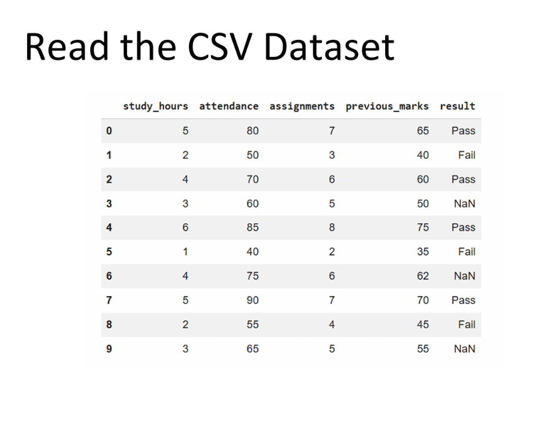
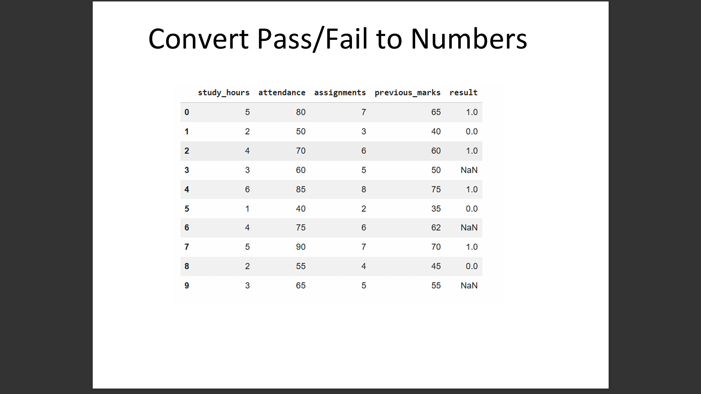
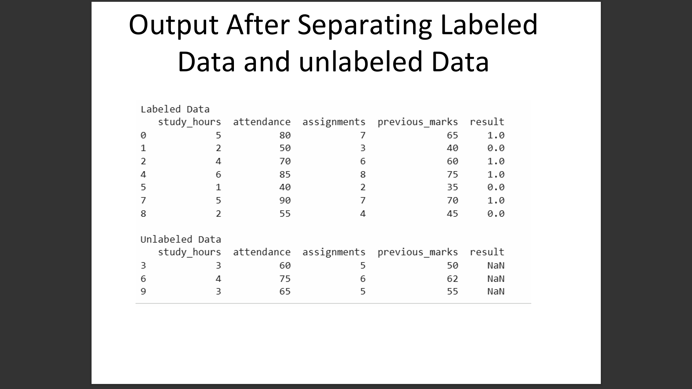
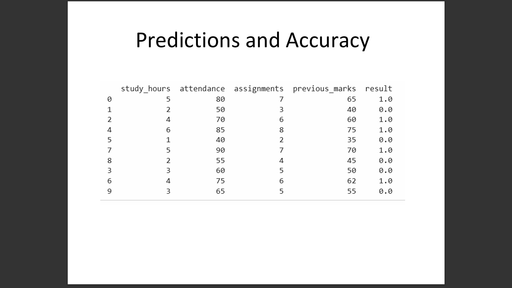
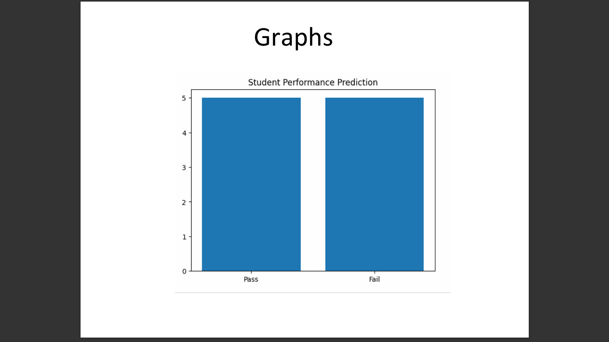

# Student Performance Prediction using Semi-Supervised Learning

## Overview
This project focuses on predicting student academic performance using Machine Learning and Semi-Supervised Learning techniques. The system analyzes student data such as study hours, attendance, assignments, and previous marks to predict whether a student will pass or fail. The project was implemented using Python in Google Colab with Scikit-learn, Pandas, and Matplotlib libraries.

## Features
- Student performance prediction
- Semi-Supervised Learning using Self-Training
- Pass/Fail prediction system
- Data preprocessing and analysis
- Graph visualization of results
- Machine learning model training and prediction

## Technologies Used
- Python
- Google Colab
- Pandas
- NumPy
- Scikit-learn
- Matplotlib

# Project Screenshots

## Read the CSV Dataset


## Convert Pass/Fail to Numbers


## Labeled and Unlabeled Data


## Predictions and Accuracy


## Graph Visualization


## Project Structure

```text
Student-Performance-Prediction-System/
│
├── Student_Performance_Prediction.ipynb
├── student_performance.csv
├── dataset-output.png
├── pass-fail-conversion.png
├── labeled-unlabeled-data.png
├── prediction-results.png
├── performance-graph.png
└── README.md
```

## Installation

### 1. Clone the repository

```bash
git clone https://github.com/YOUR-USERNAME/Student-Performance-Prediction-System.git
```

### 2. Open the project folder

```bash
cd Student-Performance-Prediction-System
```

### 3. Install required libraries

```bash
pip install pandas numpy scikit-learn matplotlib
```

## How to Run

### 1. Open the notebook

```text
Student_Performance_Prediction.ipynb
```

### 2. Run all cells in Google Colab or Jupyter Notebook

## Machine Learning Algorithm Used
- Self-Training Classifier
- Decision Tree Classifier
- Semi-Supervised Learning

## Dataset Features
- Study Hours
- Attendance
- Assignments
- Previous Marks
- Result (Pass/Fail)

## Future Improvements
- Use larger datasets
- Improve prediction accuracy
- Add advanced machine learning algorithms
- Create a web-based interface
- Add real-time student analytics dashboard

## Conclusion
This project successfully demonstrates student performance prediction using Semi-Supervised Learning techniques. The model predicts whether students will pass or fail based on academic-related features and helps in analyzing student performance efficiently.
